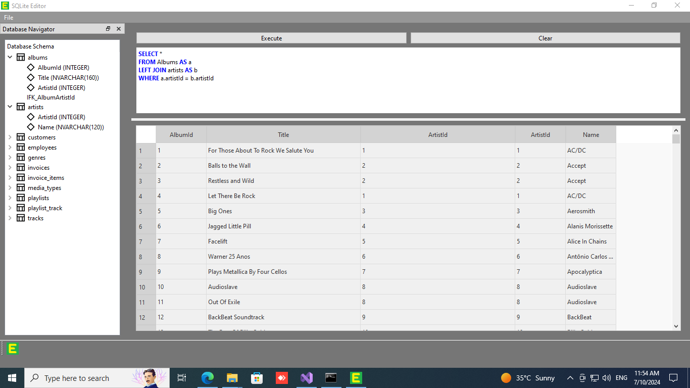

# SQLite Editor

## Introduction

SQLite Editor is a powerful and efficient tool designed to manage and edit SQLite databases with ease. It allows users to open databases, read the structure of all tables, indexes, and table field data. The editor includes a feature-rich SQL editor equipped with autocomplete and syntax highlighting tools to streamline the creation of SQL statements. The application is optimized for speed, ensuring a responsive experience even with large databases.

## Features

- **Open and Manage SQLite Databases:** Easily open and explore SQLite databases.
- **View Database Structure:** Inspect the structure of all tables, indexes, and table field data.
- **SQL Editor:** Create and execute SQL statements with an integrated editor.
- **Autocomplete:** Enhanced productivity with SQL statement autocomplete.
- **Syntax Highlighting:** Clear and readable SQL statements with syntax highlighting.
- **High Performance:** Fast and responsive interface for efficient database management.

## Screenshot



## Video Demonstration

Watch a video demonstration of SQLite Editor on [YouTube](https://www.youtube.com/watch?v=V9hBwAUSgh0).

[](https://www.youtube.com/watch?v=V9hBwAUSgh0)

## Installation

1. Clone the repository:
    ```sh
    git clone https://github.com/srdzank/SQLite-Editor.git
    ```

2. Navigate to the project directory:
    ```sh
    cd SQLite-Editor
    ```

3. Install dependencies:
    ```sh
    # If using Node.js
    npm install
    ```

4. Run the application:
    ```sh
    # If using Node.js
    npm start
    ```

## Usage

1. Open the application.
2. Click on "Open Database" to load your SQLite database file.
3. Navigate through the database structure to view tables, indexes, and field data.
4. Use the SQL editor to write and execute SQL statements with autocomplete and syntax highlighting features.

## Contributing

We welcome contributions! Please follow these steps:

1. Fork the repository: [https://github.com/srdzank/SQLite-Editor.git](https://github.com/srdzank/SQLite-Editor.git).
2. Create your feature branch:
    ```sh
    git checkout -b feature/AmazingFeature
    ```
3. Commit your changes:
    ```sh
    git commit -m 'Add some AmazingFeature'
    ```
4. Push to the branch:
    ```sh
    git push origin feature/AmazingFeature
    ```
5. Open a Pull Request.

## License

This project is licensed under the MIT License - see the [LICENSE](LICENSE) file for details.

## Acknowledgements

- Thank you to all contributors and users for their support.

## Contact

For any inquiries or feedback, please contact us at [your-email@example.com](mailto:your-email@example.com).
