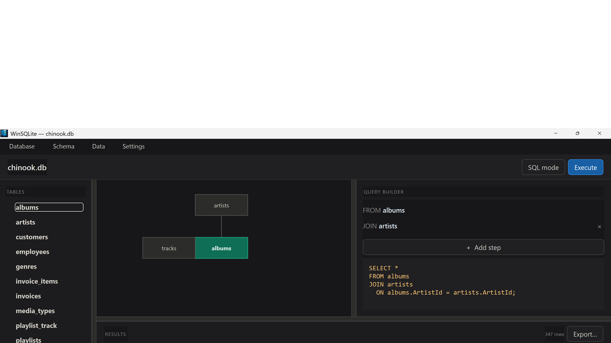
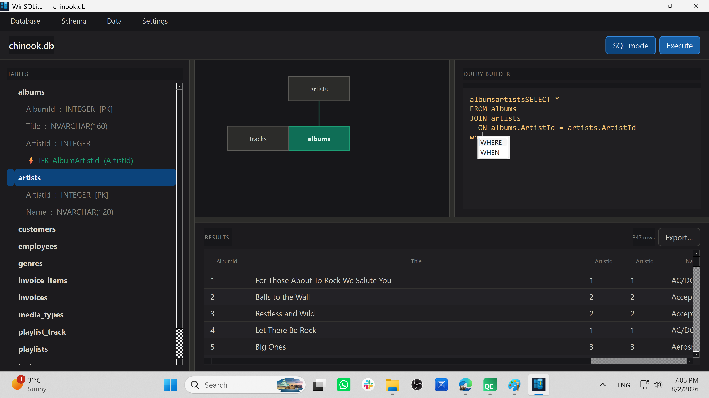

<div align="center">

# 🗄️ SQLite Editor

**A lightweight, lightning-fast, and native SQLite database browser built with C++ and Qt 6.**

[](https://github.com/srdzank/SQLite-Editor/releases/latest)
[](https://github.com/srdzank/SQLite-Editor/releases)
[](LICENSE)
[](https://apps.microsoft.com/detail/9NRD3HMXZW41)

<br />

[**Download on Microsoft Store**](https://apps.microsoft.com/detail/9NRD3HMXZW41) • [**GitHub Releases**](https://github.com/srdzank/SQLite-Editor/releases) • [**Watch Demo**](#-video-demonstration)

</div>

---

## 🌟 Overview

**SQLite Editor** is a high-performance desktop application designed for seamless SQLite database administration. Built natively with C++ and Qt 6, it delivers an ultra-responsive user experience with instant startup times, low memory consumption, and smooth handling of large database files.

---

## 📥 Download & Installation

### Option 1: Microsoft Store (Recommended)
Get automatic background updates, easy one-click installation, and support the ongoing development of the project.

<a href="https://apps.microsoft.com/detail/9NRD3HMXZW41" target="_blank" rel="noopener noreferrer">
  
</a>

### Option 2: Direct Download (Portable)
Download the standalone `.zip` or `.exe` directly from our [GitHub Releases](https://github.com/srdzank/SQLite-Editor/releases) page. No installer required.

---

## ✨ Key Features

* **📂 Database Management:** Seamlessly open, inspect, and manage SQLite database schemas, tables, fields, and indices.
* **📝 Smart SQL Editor:** Built-in code editor equipped with **syntax highlighting** and **context-aware autocomplete** for rapid SQL drafting.
* **⚡ Ultra Fast & Native:** Engineered with **C++** and **Qt 6** to ensure minimal resource overhead and rapid query execution.
* **🔍 Visual Data Browser:** View, edit, and filter table data intuitively without manual queries.
* **🔒 Privacy-First:** 100% offline-first desktop tool with zero telemetry or tracking.

---

## 📸 Screenshots

| Table & Schema Inspection | SQL Query Execution |
| :---: | :---: |
|  |  |

---

## 🎬 Video Demonstration

Watch a step-by-step walkthrough of SQLite Editor on YouTube:

[](https://www.youtube.com/watch?v=KNKUBTin_FY)

*(Click the thumbnail above to open the video)*

---

## 🛠️ Building from Source

### Prerequisites
* **Windows 10/11**
* **Qt 6.x** development environment
* **CMake 3.16+**
* C++17 or C++20 compatible compiler (MSVC 2022 / MinGW)

### Steps

```bash
# 1. Clone the repository
git clone [https://github.com/srdzank/SQLite-Editor.git](https://github.com/srdzank/SQLite-Editor.git)
cd SQLite-Editor

# 2. Configure build directory with CMake
cmake -B build -DCMAKE_PREFIX_PATH="C:/Qt/6.x/msvc2019_64"

# 3. Build the project
cmake --build build --config Release
